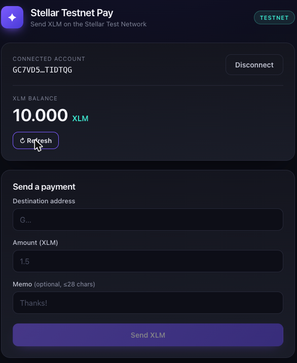
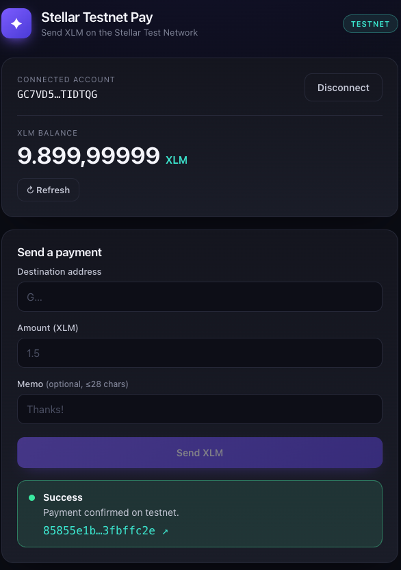

# Stellar Testnet Pay

A simple payment dApp built on the **Stellar Test Network**. Connect the
[Freighter](https://www.freighter.app/) browser wallet, view your XLM balance,
and send XLM to any address — with live transaction feedback and a link to the
block explorer.

Built as the **White Belt (Level 1)** submission for the
[Rise In — Stellar Journey to Mastery](https://www.risein.com/programs/stellar-journey-to-mastery-monthly-builder-challenges)
builder challenge.

> **🔗 Live demo:** https://ertanyeni.github.io/stellar-testnet-pay/
> **⛓️ On-chain proof:** [testnet payment tx](https://stellar.expert/explorer/testnet/tx/85855e1b9d1a2f29ad049446118a40a072113391635ed836760112063fbffc2e) (100 XLM, memo `White Belt L1`)
> ⚠️ Testnet only — no real funds are ever involved.

---

## Features

- **Wallet connect / disconnect** via Freighter
- **Network guard** — warns if Freighter isn't pointed at Testnet
- **Live XLM balance** fetched from Horizon, with a one-click **Friendbot** funding button for brand-new accounts
- **Send XLM** with destination validation, optional memo, and a proper build → sign → submit flow
- **Transaction feedback** — pending / success / failure states, plus the transaction hash linked to [stellar.expert](https://stellar.expert/explorer/testnet)

## Screenshots

| Wallet connected + balance | Successful transaction |
| --- | --- |
|  |  |

## Tech stack

- [React 19](https://react.dev/) + [TypeScript](https://www.typescriptlang.org/) + [Vite](https://vite.dev/)
- [`@stellar/stellar-sdk`](https://www.npmjs.com/package/@stellar/stellar-sdk) — Horizon queries, transaction building & submission
- [`@stellar/freighter-api`](https://www.npmjs.com/package/@stellar/freighter-api) — wallet access & transaction signing

## How it works

```
Freighter (holds keys)  ──requestAccess──►  dApp gets public key
        ▲                                        │
        │ signTransaction(xdr)                   │ loadAccount → XLM balance
        │                                        ▼
        └───────────  build payment XDR  ◄── user fills form
                              │
                              ▼
              Horizon testnet  ──submitTransaction──►  tx hash
```

- `src/lib/stellar.ts` — all Horizon interaction: balance lookup, Friendbot funding, payment-XDR building, submission, and explorer links.
- `src/lib/wallet.ts` — a thin wrapper over `@stellar/freighter-api` v6 that normalises its `{ value, error }` responses.
- `src/App.tsx` — UI and state (connect, balance, send, feedback).

## Run locally

**Prerequisites:** [Node.js](https://nodejs.org/) 20+ and the
[Freighter](https://www.freighter.app/) browser extension set to **Testnet**.

```bash
git clone https://github.com/ertanyeni/stellar-testnet-pay.git
cd stellar-testnet-pay
npm install
npm run dev
```

Then open the printed local URL (default `http://localhost:5173`).

1. Click **Connect Freighter** and approve access.
2. If the account is new, click **Fund with Friendbot** to receive test XLM.
3. Enter a destination `G…` address and an amount, then **Send XLM**.
4. Approve the signature in Freighter and watch the transaction confirm.

### Build for production

```bash
npm run build     # type-check + bundle to dist/
npm run preview   # serve the production build locally
```

## Requirements mapping (White Belt · Level 1)

| Requirement | Where |
| --- | --- |
| Set up Freighter + use Testnet | `wallet.ts`, network badge/guard in `App.tsx` |
| Wallet connect / disconnect | `connectWallet()` / `handleDisconnect()` |
| Fetch & display XLM balance | `getAccountState()` → balance card |
| Send an XLM transaction on testnet | `buildPaymentXDR()` → `signWithFreighter()` → `submitSignedXDR()` |
| Transaction feedback (success/fail + hash) | `tx-result` panel in `App.tsx` |

## License

[MIT](LICENSE)
